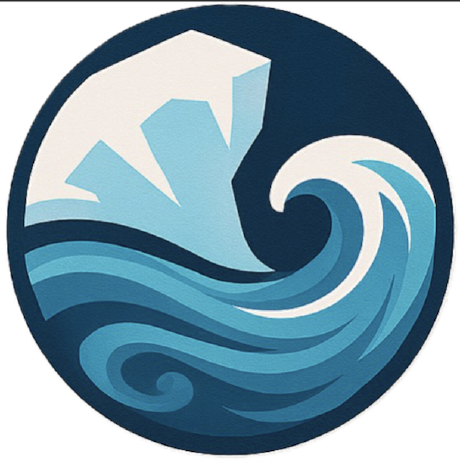

# **About**

## Welcome to the NEMO Cookbook Tutorial

As part of the [PROMOTE Analysis Sprint](https://promote-project.github.io/promote_analysis_sprint_2026/) 13th-17th July 2026, we'll be delivering a hands-on tutorial to introduce participants to the NEMO Cookbook open-source Python library for reproducible analysis and validation of NEMO ocean model outputs.

**Event Details:**

10:40-11:40 - Monday 13th July 2026

## What is NEMO Cookbook?

NEMO Cookbook extends the familiar xarray data model with grid-aware data structures designed for performing reproducible analyses of the Nucleus for European Modelling of the Ocean (NEMO) ocean general circulation model outputs.

Our aim is to provide a collection of recipes implementing the post-processing & analysis functions available in CDFTOOLS alongside new diagnostics (e.g., surface-forced water mass transformation), which are compatible with generalised vertical coordinate systems (e.g., MES).

Each recipe uses the `NEMODataTree` and `NEMODataArray` structures to leverage xarray, flox & dask libraries (think of these are your cooking utensils) to calculate a diagnostic with NEMO ocean model outputs (i.e., the raw ingredients - that's where you come in!).

## Contributors

- **Ollie Tooth** (oliver.tooth@noc.ac.uk)
- **Adam Blaker** (atb299@noc.ac.uk)
- **Andrew Coward** (acc@noc.ac.uk)

## Funding

The ongoing development of NEMO Cookbook is funded by the following projects: 

- **AtlantiS**: [Atlantic Climate and Environment Strategic Science](https://atlantis.ac.uk)
- **ARIA - PROMOTE**: [Progressing earth system Modelling for Tipping Point Early warning systems](https://aria.org.uk/opportunity-spaces/scoping-our-planet/forecasting-tipping-points/)
- **EPOC**: [Explaining & Predicting the Ocean Conveyor](https://epoc-eu.org)

---

### Next Steps...

* To get started installing NEMO Cookbook into a new virtual environment, visit the to [Getting Started] page.

* For those looking for more information, explore our [Resources] page.

[Getting Started]: getting_started.md
[Resources]: resources.md
